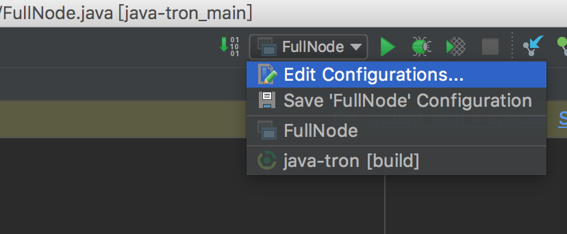

# How to Build

## Prepare dependencies

* JDK 1.8 (JDK 1.9+ are not supported yet)
* On Linux Ubuntu system (e.g. Ubuntu 16.04.4 LTS), ensure that the machine has [__Oracle JDK 8__](https://www.digitalocean.com/community/tutorials/how-to-install-java-with-apt-get-on-ubuntu-16-04), instead of having __Open JDK 8__ in the system. If you are building the source code by using __Open JDK 8__, you will get [__Build Failed__](https://github.com/tronprotocol/java-tron/issues/337) result.
* Open **UDP** ports for connection to the network
* **MINIMUM** 2 ENERGY Cores

## Getting the code with git

* Use Git from the Terminal, see the [Setting up Git](https://help.github.com/articles/set-up-git/) and [Fork a Repo](https://help.github.com/articles/fork-a-repo/) articles.
* develop branch: the newest code 
* master branch: more stable than develop.
In the shell command, type:
```bash
git clone https://github.com/wizbl-git/java-brte2.git
git checkout -t origin/master
```

* For Mac, you can also install **[GitHub for Mac](https://mac.github.com/)** then **[fork and clone our repository](https://guides.github.com/activities/forking/)**. 

* If you'd rather not use Git, [Download the ZIP](https://github.com/wizbl-git/java-brte2/archive/develop.zip)


## Building from source code

* Build in the Terminal

```bash
cd java-brte2
./gradlew build
```


* Build in [IntelliJ IDEA](https://www.jetbrains.com/idea/) (community version is enough):

  **Please run ./gradlew build once to build the protocol files**

  1. Start IntelliJ. Select `File` -> `Open`, then locate to the java-brte2 folder which you have git cloned to your local drive. Then click `Open` button on the right bottom.
  2. Check on `Use auto-import` on the `Import Project from Gradle` dialog. Select JDK 1.8 in the `Gradle JVM` option. Then click `OK`.
  3. IntelliJ will open the project and start gradle syncing, which will take several minutes, depending on your network connection and your IntelliJ configuration
  4. Enable Annotations, `Preferences` -> Search `annotations` -> check `Enable Annotation Processing`.
  5. After the syncing finished, select `Gradle` -> `Tasks` -> `build`, and then double click `build` option.
  
# Running

### Running multi-nodes

https://github.com/wizbl-git/java-brte2/blob/master/docs/deployment/FullNode_Deployment.md

## Running a local node and connecting to the public testnet 

* Use the [Testnet Config](src/main/resources/testnet-config.conf)


### Running a Super Representative Node for mainnet

* Use the executable JAR(Recommended way)

```bash
java -jar FullNode.jar -p your private key --witness -c your config.conf(Example：/data/java-brte2/config.conf)
Example:
java -jar FullNode.jar -p 650950B193DDDDB35B6E48912DD28F7AB0E7140C1BFDEFD493348F02295BD812 --witness -c /data/java-brte2/config.conf

```

This is similar to running a private testnet, except that the IPs in the `config.conf` are officially declared by WIZBL.

<details>
<summary>Correct output</summary>

```bash

20:43:18.138 INFO  [main] [o.t.p.FullNode](FullNode.java:21) Full node running.
20:43:18.486 INFO  [main] [o.t.c.c.a.Args](Args.java:429) Bind address wasn't set, Punching to identify it...
20:43:18.493 INFO  [main] [o.t.c.c.a.Args](Args.java:433) UDP local bound to: 10.0.8.146
20:43:18.495 INFO  [main] [o.t.c.c.a.Args](Args.java:448) External IP wasn't set, using checkip.amazonaws.com to identify it...
20:43:19.450 INFO  [main] [o.t.c.c.a.Args](Args.java:461) External address identified: 47.74.147.87
20:43:19.599 INFO  [main] [o.s.c.a.AnnotationConfigApplicationContext](AbstractApplicationContext.java:573) Refreshing org.springframework.context.annotation.AnnotationConfigApplicationContext@124c278f: startup date [Fri Apr 27 20:43:19 CST 2018]; root of context hierarchy
20:43:19.972 INFO  [main] [o.s.b.f.a.AutowiredAnnotationBeanPostProcessor](AutowiredAnnotationBeanPostProcessor.java:153) JSR-330 'javax.inject.Inject' annotation found and supported for autowiring
20:43:20.380 INFO  [main] [o.t.c.d.DynamicPropertiesStore](DynamicPropertiesStore.java:244) update latest block header timestamp = 0
20:43:20.383 INFO  [main] [o.t.c.d.DynamicPropertiesStore](DynamicPropertiesStore.java:252) update latest block header number = 0
20:43:20.393 INFO  [main] [o.t.c.d.DynamicPropertiesStore](DynamicPropertiesStore.java:260) update latest block header id = 00
20:43:20.394 INFO  [main] [o.t.c.d.DynamicPropertiesStore](DynamicPropertiesStore.java:265) update state flag = 0
20:43:20.559 INFO  [main] [o.t.c.c.TransactionCapsule](TransactionCapsule.java:83) Transaction create succeeded！
20:43:20.567 INFO  [main] [o.t.c.c.TransactionCapsule](TransactionCapsule.java:83) Transaction create succeeded！
20:43:20.568 INFO  [main] [o.t.c.c.TransactionCapsule](TransactionCapsule.java:83) Transaction create succeeded！
20:43:20.568 INFO  [main] [o.t.c.c.TransactionCapsule](TransactionCapsule.java:83) Transaction create succeeded！
20:43:20.569 INFO  [main] [o.t.c.c.TransactionCapsule](TransactionCapsule.java:83) Transaction create succeeded！
20:43:20.596 INFO  [main] [o.t.c.d.Manager](Manager.java:300) create genesis block
20:43:20.607 INFO  [main] [o.t.c.d.Manager](Manager.java:306) save block: BlockCapsule

```

Then observe whether block synchronization success，If synchronization successfully explains the success of the super node

</details>


### Running a Super Representative Node for private testnet
* use master branch
* You should modify the config.conf
  1. Replace existing entry in genesis.block.witnesses with your address.
  2. Replace existing entry in seed.node ip.list with your ip list.
  3. The first Super Node start, needSyncCheck should be set false
  4. Set p2pversion to any number 

* Use the executable JAR(Recommended way)

```bash
cd build/libs
java -jar FullNode.jar -p your private key --witness -c your config.conf (Example：/data/java-brte2/config.conf)
Example:
java -jar FullNode.jar -p 650950B193DDDDB35B6E48912DD28F7AB0E7140C1BFDEFD493348F02295BD812 --witness -c /data/java-brte2/config.conf

```

<details>
<summary>Show Output</summary>

```bash
> ./gradlew run -Pwitness

> Task :generateProto UP-TO-DATE
Using TaskInputs.file() with something that doesn't resolve to a File object has been deprecated and is scheduled to be removed in Gradle 5.0. Use TaskInputs.files() instead.

> Task :run 

20:21:33.916 INFO  [main] [c.w.p.FullNode](FullNode.java:47) not in debug mode, it will check energy time
20:21:34.021 INFO  [main] [c.w.c.a.Brte2ApplicationContext](AbstractApplicationContext.java:573) Refreshing com.wizbl.common.application.Brte2ApplicationContext@13b13b5d: startup date [Mon Jan 03 20:21:34 KST 2022]; root of context hierarchy
20:21:34.622 INFO  [main] [o.s.b.f.a.AutowiredAnnotationBeanPostProcessor](AutowiredAnnotationBeanPostProcessor.java:153) JSR-330 'javax.inject.Inject' annotation found and supported for autowiring
20:21:35.524 INFO  [main] [NodeManager](NodeManager.java:100) homeNode : Node{ host='120.17.80.224', port=42060, id=7920adca836f24014edaa168cd1952dee91c9792e104e9a1c3c2eebab2d46d0ccfcb694d9e460b8b4af3f5ae3811c4d4dd04267bb3cc0141e9500cdf0e5c0295}
20:21:35.524 INFO  [main] [NodeManager](NodeManager.java:101) bootNodes : size= 1
20:21:36.202 INFO  [main] [c.w.c.o.s.PeerConnectionCheckService](PeerConnectionCheckService.java:46) start the PeerConnectionCheckService
20:21:36.250 INFO  [main] [c.w.p.FullNode](FullNode.java:87) ********register application shutdown hook********
20:21:36.279 INFO  [DiscoverServer] [DiscoverServer](DiscoverServer.java:104) Discovery server started, bind port 42060
20:21:36.281 INFO  [nioEventLoopGroup-2-1] [NodeManager](NodeManager.java:147) Reading Node statistics from PeersStore: 12 nodes.
20:21:36.391 INFO  [main] [c.w.c.s.RpcApiService](RpcApiService.java:125) RpcApiService started, listening on 44160
20:21:36.399 INFO  [main] [o.e.j.u.log](Log.java:193) Logging initialized @3990ms to org.eclipse.jetty.util.log.Slf4jLog
20:21:36.548 WARN  [main] [o.e.j.s.h.ContextHandler](ContextHandler.java:1566) o.e.j.s.ServletContextHandler@176f7f3b{/,null,UNAVAILABLE} contextPath ends with /
20:21:36.562 INFO  [main] [o.e.j.s.Server](Server.java:374) jetty-9.4.11.v20180605; built: 2018-06-05T18:24:03.829Z; git: d5fc0523cfa96bfebfbda19606cad384d772f04c; jvm 1.8.0_202-b08
20:21:36.595 INFO  [main] [o.e.j.s.session](DefaultSessionIdManager.java:365) DefaultSessionIdManager workerName=node0
20:21:36.596 INFO  [main] [o.e.j.s.session](DefaultSessionIdManager.java:370) No SessionScavenger set, using defaults
20:21:36.597 INFO  [main] [o.e.j.s.session](HouseKeeper.java:149) node0 Scavenging every 660000ms
20:21:36.608 INFO  [main] [o.e.j.s.h.ContextHandler](ContextHandler.java:851) Started o.e.j.s.ServletContextHandler@176f7f3b{/wallet,null,AVAILABLE}
20:21:36.615 INFO  [main] [o.e.j.s.AbstractConnector](AbstractConnector.java:289) Started ServerConnector@30c1da48{HTTP/1.1,[http/1.1]}{0.0.0.0:43160}
20:21:36.615 INFO  [main] [o.e.j.s.Server](Server.java:411) Started @4206ms
20:21:36.622 INFO  [main] [c.w.c.s.i.RpcApiServiceOnSolidity](RpcApiServiceOnSolidity.java:95) RpcApiServiceOnSolidity started, listening on 44260
20:21:36.623 INFO  [main] [o.e.j.s.Server](Server.java:374) jetty-9.4.11.v20180605; built: 2018-06-05T18:24:03.829Z; git: d5fc0523cfa96bfebfbda19606cad384d772f04c; jvm 1.8.0_202-b08
20:21:36.624 INFO  [main] [o.e.j.s.session](DefaultSessionIdManager.java:365) DefaultSessionIdManager workerName=node0
20:21:36.624 INFO  [main] [o.e.j.s.session](DefaultSessionIdManager.java:370) No SessionScavenger set, using defaults
20:21:36.624 INFO  [main] [o.e.j.s.session](HouseKeeper.java:149) node0 Scavenging every 660000ms
20:21:36.625 INFO  [main] [o.e.j.s.h.ContextHandler](ContextHandler.java:851) Started o.e.j.s.ServletContextHandler@4f94e148{/,null,AVAILABLE}
20:21:36.626 INFO  [main] [o.e.j.s.AbstractConnector](AbstractConnector.java:289) Started ServerConnector@7ff8a9dc{HTTP/1.1,[http/1.1]}{0.0.0.0:43260}
20:21:36.627 INFO  [main] [o.e.j.s.Server](Server.java:411) Started @4217ms
20:21:36.628 INFO  [main] [ChannelManager](ChannelManager.java:76) Trust peer size 1
20:21:36.637 INFO  [main] [c.w.c.n.n.NodeImpl](NodeImpl.java:586) other peer is nil, please wait ... 

```

</details>

* In IntelliJ IDEA
  
<details>
<summary>

Open the configuration panel:

</summary>



</details>  

<details>
<summary>

In the `Program arguments` option, fill in `--witness`:

</summary>


</details> 

Then, run `FullNode::main()` again.

# Advanced Configurations

Read the [Advanced Configurations](src/main/java/com/wizbl/core/config/README.md).

